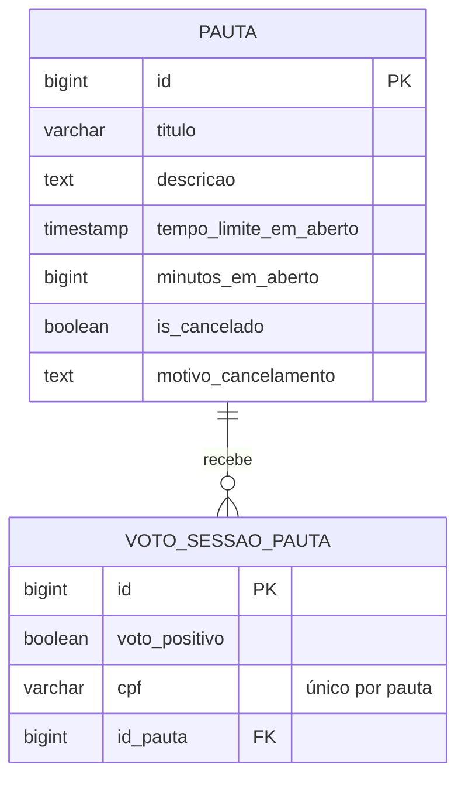

# 🗳️ Decisões Pautas

<div align="center">
  
  
  
  
  
</div>

<br>

> 🎯 **API REST em Java 21 e Spring Boot 4 para criar pautas**, abrir sessões de votação com tempo limitado e registrar um voto de sim ou não por CPF.

Fiz o projeto em 2024 como desafio técnico. Em 2026 voltei a ele para corrigir bugs, atualizar as dependências e fazer parte do que tinha ficado na lista de futuro.

## 📋 Índice

- [🚀 Como rodar](#-como-rodar)
- [📚 Endpoints](#-endpoints)
- [📏 Regras](#-regras)
- [🧩 Como o código funciona](#-como-o-código-funciona)
- [🎓 O que fiz em 2024](#-o-que-fiz-em-2024)
- [🔄 Revisitando o projeto em 2026](#-revisitando-o-projeto-em-2026)
- [🔭 Próximos passos](#-próximos-passos)

## 🚀 Como rodar

Precisa do JDK 21 e de um PostgreSQL com um banco chamado `pautas`. As tabelas são criadas pelas migrations do Flyway na primeira execução.

Com Docker, o `compose.yaml` sobe o PostgreSQL 16 já com o banco:

```bash
docker compose up -d
```

Depois, a API:

```bash
./mvnw spring-boot:run
```

No Windows, use `mvnw.cmd`. A API sobe em `http://localhost:8080`.

A conexão com o banco vem de variáveis de ambiente, com padrão para rodar localmente:

| Variável | Padrão |
|---|---|
| `DB_URL` | `jdbc:postgresql://localhost:5432/pautas` |
| `DB_USERNAME` | `postgres` |
| `DB_PASSWORD` | `postgres` |

A documentação fica no Swagger, em `http://localhost:8080/swagger-ui.html`, e o JSON do OpenAPI em `/v3/api-docs`. Também deixei uma [collection do Postman](https://documenter.getpostman.com/view/12044113/2sA3XQi2sc#4d33dc8e-6ffa-45ac-a444-dd130d59b0e4), que usei para testar manualmente.

Os testes rodam com `./mvnw test`. Os de service e de mapper não precisam de banco. O `DecisoesPautasApplicationTests` sobe a aplicação inteira e precisa do PostgreSQL rodando.

## 📚 Endpoints

| Método | Rota | O que faz |
|---|---|---|
| `GET` | `/pauta` | Lista as pautas com a contagem de votos |
| `GET` | `/pauta/{id}` | Busca uma pauta |
| `POST` | `/pauta` | Cria uma pauta com `titulo`, `descricao` e `minutosEmAberto` |
| `PATCH` | `/pauta?id={id}` | Inicia a votação |
| `POST` | `/pauta/cancelamento` | Cancela a pauta, com `id` e `motivoCancelamento` |
| `POST` | `/voto` | Registra um voto: `cpf`, `votoPositivo` e `pauta.id` |
| `GET` | `/voto?id={id}` | Busca um voto |

## 📏 Regras

- A pauta nasce `NAO_INICIADA`. Ao iniciar, fica `EM_VOTACAO` pelo tempo de `minutosEmAberto`, ou 1 minuto se não for informado. Depois disso, passa a `ENCERRADA`.
- Só aceita voto enquanto está `EM_VOTACAO`.
- O CPF precisa ter 11 dígitos e dígitos verificadores válidos. Cada CPF vota uma vez por pauta.
- Uma pauta cancelada não aceita mais voto nem pode ser iniciada.
- Com a votação encerrada, o campo `resultado` mostra `APROVADA`, `REPROVADA` ou `EMPATE`.
- Erro de regra volta com status 400, pauta ou voto inexistente com 404, sempre no formato `{"message": "..."}`.

Exemplo de pauta encerrada:

```json
{
  "id": 1,
  "titulo": "Reforma do salão",
  "descricao": "Aprovar o orçamento da reforma",
  "minutosEmAberto": 5,
  "tempoLimiteEmAberto": "2026-09-23T21:10:00",
  "cancelado": false,
  "motivoCancelamento": null,
  "votosSim": 12,
  "votosNao": 4,
  "status": "ENCERRADA",
  "resultado": "APROVADA"
}
```

## 🧩 Como o código funciona

```
src/main/java/com/luiz/decisoespautas/
├── controllers/     # PautaController e VotoSessaoPautaController, só recebem e repassam
├── service/         # PautaService e VotoSessaoPautaService, todas as regras e validações
├── repositories/    # Spring Data JPA; a consulta de pauta já traz a contagem de votos
├── entities/        # Pauta e VotoSessaoPauta
├── dtos/v1/         # PautaDTO, VotoSessaoPautaDTO, CancelamentoPautaRequestDTO e os mappers
├── enums/           # StatusPauta e ResultadoVotacao
├── exceptions/      # ResponseExceptionHandler transforma exceção em 400, 404 ou 500
└── utils/           # ValidaCpf
src/main/resources/db/migration/
├── V1__cria_tabelas.sql
└── V2__voto_unico_por_cpf.sql
```

- **Contagem de votos numa consulta só.** O `PautaRepository` faz `LEFT JOIN` com os votos e soma com `SUM(CASE ...)`, montando a `Pauta` com `votosSim` e `votosNao` direto no JPQL. Não existe coluna de contagem para manter sincronizada.
- **Status calculado, não guardado.** `StatusPauta.de` olha o cancelamento e o `tempoLimiteEmAberto`. Nenhum job precisa encerrar a votação, porque o prazo já diz se ela está aberta.
- **Voto validado no service.** O `VotoSessaoPautaService` confere CPF, pauta, status e voto repetido antes de gravar.
- **Erros centralizados.** As regras lançam `IllegalArgumentException` ou `EntityNotFoundException`, e o `ResponseExceptionHandler` decide o status HTTP.



## 🎓 O que fiz em 2024

Documentei a API com Swagger, testei os fluxos manualmente pelo Postman e usei o SonarLint para manter o código limpo e diminuir a chance de erro. Os services e os mappers têm testes unitários com JUnit e Mockito.

A tarefa bônus 1 do desafio pedia o uso de uma API externa, mas essa API não funciona mais. O CPF é validado localmente, pelo cálculo dos dígitos verificadores.

## 🔄 Revisitando o projeto em 2026

Uma análise nova encontrou bugs que deixavam o banco ser apagado, votos repetidos passarem e erros de entrada virarem erro 500. Também atualizei o Spring Boot 3.3, que estava sem suporte.

### 🐛 Bugs corrigidos

| Bug | Causa | Correção |
|---|---|---|
| Reiniciar a API apagava todas as pautas e votos | `hbm2ddl.auto: create-drop` no `application.yml`, que sobrescrevia o `ddl-auto: update` | Schema gerenciado por migrations do Flyway, com `ddl-auto: validate` |
| O mesmo CPF conseguia votar várias vezes na mesma pauta | A checagem de voto repetido e o insert não eram atômicos: requisições simultâneas passavam juntas | Índice único `(id_pauta, cpf)` no banco; a violação volta como 400 |
| `POST /pauta` com `id` sobrescrevia uma pauta existente, inclusive reabrindo uma cancelada | O DTO recebido virava entidade inteira, com id, prazo e cancelamento | `PautaService.salvar` cria sempre uma pauta nova, só com título, descrição e minutos |
| Voto sem pauta, sem CPF ou título com mais de 255 caracteres davam erro 500 | Faltava validação antes do acesso ao banco | Validações no service, com mensagem e status 400 |
| Voto sem `votoPositivo` era aceito, não contava e bloqueava o CPF | Campo não validado | Voto precisa ser `true` ou `false` |
| `minutosEmAberto` negativo era aceito e a pauta já nascia encerrada | Campo não validado | Precisa ser maior que zero |
| O CPF `ABCDEFGHI45` passava na validação | O cálculo subtraía 48 de qualquer caractere, não só de dígitos | `ValidaCpf` exige 11 dígitos antes do cálculo |
| A resposta do voto mostrava a contagem de antes do voto, e `GET /voto` mostrava a contagem vazia | A pauta da resposta vinha de antes do insert, ou da entidade sem as somas | A pauta é recarregada com a contagem atual |

### 🧠 Decisões técnicas

**Flyway com baseline na versão 0**

Quem já rodou a versão antiga tem as tabelas criadas pelo Hibernate. A V1 usa `create table if not exists`, e o `baseline-on-migrate` na versão 0 faz a V1 e a V2 rodarem em qualquer banco:

- Banco novo: a V1 cria as tabelas e a V2 cria o índice.
- Banco da versão antiga: a V1 não faz nada, a V2 cria o índice e os dados continuam lá.
- Se esse banco tiver votos repetidos do bug antigo, a V2 falha até os repetidos serem removidos.

**Voto repetido barrado em duas camadas**

A consulta `existsByPautaIdAndCpf` dá a mensagem clara no caso comum. O índice único garante a regra quando duas requisições do mesmo CPF chegam juntas. No teste com 30 votos simultâneos do mesmo CPF, a versão antiga gravou até 6, e a nova grava 1.

**Configuração por variável de ambiente**

A senha do banco estava fixa no `application.yml`. Agora URL, usuário e senha vêm de `DB_URL`, `DB_USERNAME` e `DB_PASSWORD`, com padrão local para não atrapalhar quem só quer rodar.

**Organização do código**

- **Injeção pelo construtor.** `@RequiredArgsConstructor` com campos `final` no lugar de `@Autowired` em campo, o que também facilita testar.
- **`@RequestParam` no lugar de `@PathParam`.** O `@PathParam` era do `jakarta.websocket` e só funcionava porque o Spring trata parâmetro sem anotação como query string. Os endpoints continuam os mesmos.
- **DTOs sem "Request" no nome.** `PautaDTO` e `VotoSessaoPautaDTO` servem de entrada e de saída.
- **Nomes consistentes.** `buscarPorId`, `salvar`, `cancelar` e `iniciarVotacao`, no lugar da mistura de `find`, `save`, `encontraPorId` e `ativarVotacao`.
- **Entidades com `@Getter` e `@Setter`.** O `@Data` gerava `equals` e `hashCode` com todos os campos, o que dá problema em entidade JPA.
- **Sem classe interna do JDK.** O handler tratava `com.sun.jdi.request.DuplicateRequestException`, que nunca era lançada e depende de um módulo de depuração do JDK.
- **Mesmo resultado.** Um roteiro de 40 requisições HTTP rodou antes e depois da limpeza, contra um PostgreSQL de verdade, com respostas idênticas. O `ValidaCpf` reescrito deu o mesmo resultado do antigo em mais de 1 milhão de entradas.

## 🔭 Próximos passos

- Teste de integração com banco embarcado, para o `mvn test` não depender de um PostgreSQL rodando.
- Contagem de votos em tempo real.
- Mensageria (Kafka) para absorver picos de votação.

---

<div align="center">
  <p>Desenvolvido por <strong>Luiz Matos</strong></p>
  <p>
    <a href="https://github.com/luiz-matos">GitHub</a> •
    <a href="https://www.linkedin.com/in/luizeduardomatos/">LinkedIn</a>
  </p>
</div>
