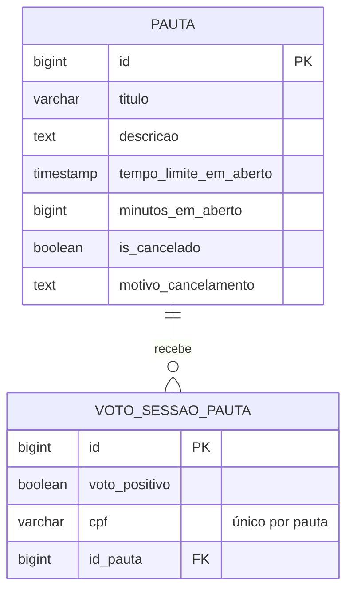

# 🗳️ Decisões Pautas

<div align="center">
  
  
  
  
  
  
</div>

<br>

> 🎯 **API REST em Java 21 e Spring Boot 4 para criar pautas**, abrir sessões de votação com tempo limitado e registrar um voto de sim ou não por CPF.

Fiz o projeto em 2024 como desafio técnico. Em 2026 voltei a ele para corrigir bugs, atualizar as dependências e fazer parte do que tinha ficado na lista de futuro.



## 📋 Índice

- [🎓 O que aprendi](#-o-que-aprendi)
- [🚀 Como rodar](#-como-rodar)
- [🧠 Decisões técnicas](#-decisões-técnicas)
- [🔄 Revisitando o projeto em 2026](#-revisitando-o-projeto-em-2026)
- [🔬 Próximos passos](#-próximos-passos)
- [📄 Licença](#-licença)

## 🎓 O que aprendi

- **Qualidade desde o começo.** Em 2024 documentei a API com Swagger, testei os fluxos manualmente pelo Postman, usei o SonarLint para manter o código limpo e escrevi testes unitários dos services e dos mappers com JUnit e Mockito.
- **Dado derivado não precisa ser guardado.** O status da pauta sai do cancelamento e do prazo, então nenhum job precisa encerrar a votação. A contagem de votos sai de uma consulta só, com `SUM(CASE ...)`, sem coluna para manter sincronizada.
- **Conferir e gravar não é atômico.** Com 30 votos simultâneos do mesmo CPF, a versão antiga gravou até 6. A consulta dá a mensagem clara no caso comum, e o índice único `(id_pauta, cpf)` garante a regra quando as requisições chegam juntas.
- **O corpo da requisição não decide o que a API grava.** Um `POST /pauta` com `id` sobrescrevia uma pauta existente e até reabria uma cancelada. Hoje o service cria sempre uma pauta nova, só com título, descrição e minutos.
- **O schema do banco precisa de dono.** O `create-drop` apagava todas as pautas a cada reinício. Com o Flyway, as migrations criam as tabelas, e a baseline na versão 0 serve tanto para banco novo quanto para o banco da versão antiga.
- **Refatorar com prova.** Um roteiro de 40 requisições rodou antes e depois da limpeza, com respostas idênticas, e o `ValidaCpf` reescrito deu o mesmo resultado do antigo em mais de 1 milhão de entradas.

## 🚀 Como rodar

Precisa do JDK 21 e do Docker. O `compose.yaml` sobe o PostgreSQL 16 com o banco `pautas`, e o Flyway cria as tabelas.

```bash
docker compose up -d     # PostgreSQL
./mvnw spring-boot:run   # API em http://localhost:8080 (no Windows, mvnw.cmd)
```

| Rotas | O que fazem |
|---|---|
| `GET`, `POST` em `/pauta` e `GET /pauta/{id}` | Lista, cria e busca pautas, com a contagem de votos |
| `PATCH /pauta?id={id}` e `POST /pauta/cancelamento` | Inicia a votação e cancela a pauta |
| `POST /voto` e `GET /voto?id={id}` | Registra e busca um voto |

A pauta fica em votação pelo tempo de `minutosEmAberto` e, encerrada, mostra `APROVADA`, `REPROVADA` ou `EMPATE`. A documentação fica no Swagger, em `http://localhost:8080/swagger-ui.html`, e também deixei uma [collection do Postman](https://documenter.getpostman.com/view/12044113/2sA3XQi2sc#4d33dc8e-6ffa-45ac-a444-dd130d59b0e4). Os testes rodam com `./mvnw test`; o teste que sobe a aplicação precisa do PostgreSQL.

## 🧠 Decisões técnicas

| Decisão | Alternativa | Por quê |
|---|---|---|
| Status calculado pelo prazo | Um job que encerra as votações | O prazo já diz se a votação está aberta |
| Contagem de votos no JPQL | Coluna de contagem na pauta | Uma consulta só, sem valor para manter sincronizado |
| Voto repetido barrado na consulta e no índice único | Só uma das duas | A consulta dá a mensagem clara; o índice garante a regra sob concorrência |
| Flyway com baseline na versão 0 | Recriar o banco | Quem rodou a versão antiga mantém os dados |
| CPF validado pelos dígitos verificadores | A API externa da tarefa bônus do desafio | Essa API não funciona mais |
| Banco por variável de ambiente | Senha fixa no `application.yml` | Padrão local para rodar, sem senha no código |

## 🔄 Revisitando o projeto em 2026

Uma análise nova encontrou bugs que deixavam o banco ser apagado, votos repetidos passarem e erros de entrada virarem erro 500. Também atualizei o Spring Boot 3.3, que estava sem suporte. Dos 8 bugs corrigidos, os principais:

| O que estava errado | O que mudou |
|---|---|
| Reiniciar a API apagava todas as pautas e votos | Schema pelas migrations do Flyway, com `ddl-auto: validate` |
| O mesmo CPF votava várias vezes na mesma pauta | Índice único `(id_pauta, cpf)`; a violação volta como 400 |
| `POST /pauta` com `id` sobrescrevia uma pauta existente | `PautaService.salvar` cria sempre uma pauta nova |
| Voto sem pauta ou sem CPF dava erro 500 | Validações no service, com mensagem e status 400 |
| O CPF `ABCDEFGHI45` passava na validação | `ValidaCpf` exige 11 dígitos antes do cálculo |

## 🔬 Próximos passos

- Teste de integração com banco embarcado, para o `mvn test` não depender de um PostgreSQL rodando.
- Contagem de votos em tempo real.
- Mensageria (Kafka) para absorver picos de votação.

## 📄 Licença

[MIT](LICENSE)

---

<div align="center">
  <p>Desenvolvido por <strong>Luiz Matos</strong></p>
  <p>
    <a href="https://github.com/luiz-matos">GitHub</a> •
    <a href="https://www.linkedin.com/in/luizeduardomatos/">LinkedIn</a>
  </p>
</div>
